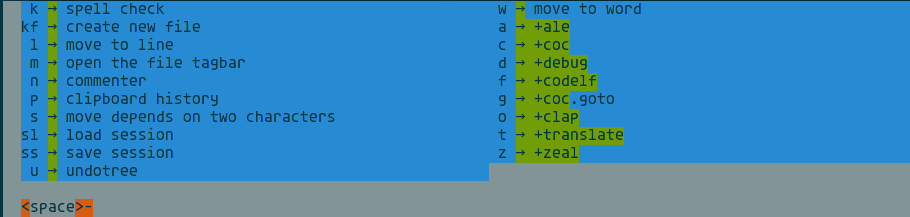

# vim 快捷键管理

本文主要介绍如何使用`vim-which-key`管理 vim 快捷键。

## 快捷键管理

- 什么是快捷键管理？

这里的所谓快捷键管理，不是指修改快捷键，而是快捷键提示。

- 为什么需要快捷键管理？

当你比较熟悉 vim 之后，就会使用各种快捷键。随着 vim 的不断扩展，需要为各种插件设置快捷键。从简单的`ctrl`、`alt`、`shift`组合到`<space>`、`<leader>`的使用，你终将配置连自己都数不清的快捷键。幸运的是， vim 的一个好处在于，它可以设置无数快捷键。但不幸的是，人脑不可能记住那么多快捷键。

快捷键管理的好处在于，只要你有一个印象，甚至哪怕是一点印象都没有，你终将在它的提示中找到你要的那个键。

## vim-which-key

### 效果图



以上为在普通模式下按下空格键时给出的提示。

### vim-which-key 安装

访问其[github 主页](https://github.com/liuchengxu/vim-which-key)

直接用插件管理器安装即可。

### vim-which-key 配置

首先给出我的部分配置，分析在配置中。

```vim
" 定义字典变量，这将是后续为具体快捷键定义提示的基础。注意这些行必须在所有具体定义之前，否则会报错，提示变量未定义。
let g:which_key_map1 =  {}
let g:which_key_map2 =  {}

" 设置leader与localleader键位，也可以不设置，明确是哪个就好。
let g:mapleader = "\\"
let g:maplocalleader = "\<Space>"

" 为具体的按键绑定字典变量。这样当按下该键一段时间后，会自动展开该键下的提示。
call which_key#register('<Space>', "g:which_key_map1")
call which_key#register('\', "g:which_key_map2")

" 定义vim-which-key自身的快捷键，使得插件在该键按下的时候响应。
nnoremap <silent> <localleader> :<c-u>WhichKey '<Space>'<CR>
vnoremap <silent> <localleader> :<c-u>WhichKeyVisual '<Space>'<CR>
nnoremap <silent> <leader> :<c-u>WhichKey '\'<CR>
vnoremap <silent> <leader> :<c-u>WhichKeyVisual '\'<CR>

" 隐藏提供的提供的statusline的主题（该主题不灵活）。也可以不设置。
autocmd! FileType which_key
autocmd  FileType which_key set laststatus=0 noshowmode noruler
			\| autocmd BufLeave <buffer> set laststatus=2 showmode ruler
```

至此，我们可以为具体快捷键配置提示信息了。

### 具体提示信息配置

默认情况下，即使不进行配置，vim-which-key 也会自动搜集所有插件的快捷键，但是仅显示快捷键绑定的命令，提示效果较差。

为获得更好的提示体验，最好手动配置提示信息。提供以下几个案例，参考一下即可。

- 案例一

```vim

" coc-translator
" popup
nmap <silent><nowait> <space>tp  <Plug>(coc-translator-p)
vmap <silent><nowait> <space>tp  <Plug>(coc-translator-pv)
" echo
nmap <silent><nowait> <space>te  <Plug>(coc-translator-e)
vmap <silent><nowait> <space>te  <Plug>(coc-translator-ev)
" replace
nmap <silent><nowait> <space>tr  <Plug>(coc-translator-r)
vmap <silent><nowait> <space>tr  <Plug>(coc-translator-rv)

" 以上为其余插件的快捷键配置。以下为vim-which-key的配置。

let g:which_key_map1.t = {
			\ 'name' : '+translate',
			\ 'p' : 'popup',
			\ 'e' : 'echo',
			\ 'r' : 'replace',
			\ }
```

- 案例二

```vim
let g:which_key_map1.l = 'move to line'
```

- 案例三

注意该案例中`l`处又是一层嵌套。

```vim
let g:which_key_map1.d = {
			\ 'name' : '+debug',
			\ 'e' : 'eval',
			\ 'w' : 'variable watch',
			\ 's' : 'start or continue',
			\ 't' : 'stop',
			\ 'r' : 'restart',
			\ 'p' : 'pause',
			\ 'b' : 'set breakpoint',
			\ 'c' : 'set condition breakpoint',
			\ 'f' : 'add function breakpoint',
			\ 'n' : 'next',
			\ 'i' : 'step in',
			\ 'o' : 'step out',
			\ 'q' : 'quit',
			\ 'l' :  {
			\ 'name' : '+switch_output',
			\ 'c' : 'Console',
			\ 'd' : 'stderr',
			\ 'o' : 'Vimspector-out',
			\ 'e' : 'Vimspector-err',
			\ 's' : 'server',
			\ 't' : 'Telemetry',
			\},
			\}
```

你也可以忽略部分按键的提示，将其提示设置为`which_key_ignore`即可。比如

```vim
let g:which_key_map2['\'] = 'which_key_ignore'
let g:which_key_map2['\A'] = 'which_key_ignore'
````
